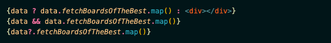

### 1. 라우터 객체와 라우팅

라우터(router) 객체란, 페이지 이동과 관련된 기능을 가진 객체이다. 라우터 객체를 사용해서 페이지A에서 페이지B로 이동할 때, 'B페이지로 라우팅한다'고 한다. 

- [**참고!** 자주 사용하는 라우터 객체 기능](https://nextjs.org/docs/api-reference/next/router)

```javascript
import Router from 'next/router'

export default function Routing() {
    const handleClickPathname = () => {
        const pathname = Router.pathname
        alert(pathname)
    }

    const handleClickAsPath = () => {
        const asPath = Router.asPath
        alert(asPath)
    }

    const handleClickBack = () => {
        Router.back()
    }

    const handleClickPush = () => {
        Router.push('/')
    }

    const handleClickReload = () => {
        Router.reload()
    }

    const handleClickReplace = () => {
        Router.replace('/')
    }


    return (
      <>
        <button onClick={handleClickPathname}>현재 위치 주소: Router.pathname</button><br/>
        <button onClick={handleClickAsPath}>현재 위치 주소: Router.asPath</button><br/>
        <button onClick={handleClickBack}>뒤로가기 버튼: Router.back()</button><br/>
        <button onClick={handleClickPush}>현재 페이지에서, 다른 페이지로 이동: Router.push()</button><br/>
        <button onClick={handleClickReload}>새로고침: Router.reload()</button><br/>
        <button onClick={handleClickReplace}>현재 페이지 삭제 후, 다른 페이지로 이동: Router.replace()</button><br/>
      </>
    )
  }
```

#### 1.1. 정적 라우팅과 동적 라우팅

- 정적(static) 라우팅
/login 페이지는 누가 언제 접속해도 항상 로그인 페이지가 나온다. 이런 페이지로 이동하는 걸 '정적 라우팅한다'고 말한다.

- 동적(dynamic) 라우팅
반면, 게시판 상세보기와 같은 경우에는 글 번호에 따라 주소가 변경된다. 그런데 게시글이 1억 개라면 1억 개의 페이지를 만들어야 할까? 그건 너무너무 힘들기 때문에 이러한 라우팅을 효과적으로 처리하기 위해 '동적 라우팅'을 사용한다. 

- /board/**1**   ⇒   **1번 게시글** 상세보기 페이지
- /board/**2**   ⇒   **2번 게시글** 상세보기 페이지
- /board/**3**   ⇒   **3번 게시글** 상세보기 페이지
- /board/**4**   ⇒   **4번 게시글** 상세보기 페이지

이렇게 이동하는 것을 '동적 라우팅한다'고 말한다.

next.js에서는 동적 라우팅을 제공해준다. 보여주고자 하는 폴더 이름의 파위 폴더로 [boardId] 폴더를 만들어준 후 이 안에 index.js 파일을 만들어주면 동적 라우팅을 사용할 수 있다. 

대괄호로 감싸준 폴더를 만들어주면 이동해주려는 페이지 혹은 게시글 번호가 대괄호 안에 쓰인 변수명 안에 담겨져서 그 변수 안에 있는 데이터를 꺼내 조회할 수 있다. (즉, 대괄호 내의 폴더명은 변수명이라 아무거나 상관 없다는 뜻!) 이러한 과정을 라우터 객체가 도와준다.


### 2. 비동기 통신과 조건부렌더링

자바스크립트는 작성된 코드가 상단에서부터 순차적으로 실행되기 때문에, 데이터를 요청하고 응답을 받아오는 동안 화면에 그려질 데이터의 내용이 undefined이다. 따라서 이 첫 화면이 그려지는 시기에 데이터를 불러오면서 에러가 발생한다. 이 부분을 효율적으로 실행하기 위해 화면을 미리 그려놓고 데이터를 넣어주기 위해 조건부 렌더링을 사용한다. 조건부 렌더링에는 세 가지가 있다: &&연산자, 삼항연산자, 그리고 옵셔널 체이닝이 그것이다.


- 삼항연산자
가장 처음에는 **삼항 연산자**를 사용했다. data는 동기적으로 받아와야 하는 데이터인데, 데이터가 오기 전에 이미 return 부분에서 렌더링을 해주고 있기 대문에 삼항 연산자를 써서 데이터가 있을 때와 없을 때를 모두 적어주어야 했다.

```javascript
data ? data.fetchProfile : undefined
```

해석해보면, ?의 앞쪽은 '데이터가 있을 때', ?와 : 사이 내용은 '프로필을 가져와라'
: 뒷쪽은 '데이터가 없으면 undefined를 반환하라'를 의미한다.


- &&연산자
그 이후에는 **&&연산자**를 사용했다. &&연산자는 데이터가 없을 경우 자동으로 undefined를 반환해주기 때문에 '삼항'을 쓸 필요가 없다.

```javascript
data && data.fetchProfile
```


**※ Nullish Coalescing**
&&연산자는 앞의 값이 참일 경우에만 뒤의 값을 보여주었는데, 이와 반대로 앞의 값이 거짓일 때 뒤의 값을 보여주는 경우를 nullish coalescing 연산자라 부른다. ??연산자는 앞의 값이 빈 값이면 뒤의 값을 보여주며, ||연산자는 앞의 값이 거짓일 경우 뒤의 값을 보여준다.

```javascript
data ?? data.fetchProfile // 앞의 값이 빈 값일 때
data || data.fetchProfile // 앞의 값이 거짓일 때
```


- 옵셔널 체이닝
optional-chaining이란, &&연산자를 스면서 길어졌던 코드를 간결하게 사용하는 연산자이다. (ES2020 최신-문법!) 다음과 같이 사용한다.

```javascript
// data && data.fetchProfile (&&연산자 사용)
data?.fetchProfile
```
옵셔널 체이닝은 ?연산자 앞 객체의 참조가 undefined 혹은 null일 때 undefined를 리턴한다. 
조건부 렌더링 세 가지를 함께 보면 다음과 같다. (최신 문법인 옵셔널 체이닝을 사용하면 좋은 이유!)

