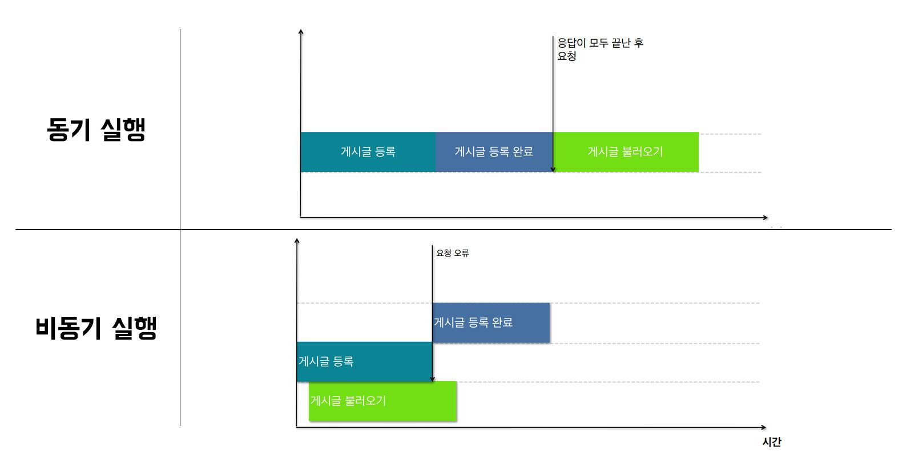

### 1. 동기 실행과 비동기 실행
이전 포스팅은 http 통신에 관한 것이었다. http를 통해 요청과 응답을 하는데 문제가 발생할 수 있다. 예를 들어, 글을 등록하고 불러오기를 했는데 안 되는 경우이다. 이는 등록 완료 전에 불러오기를 했기 때문이다. 이게 바로 비동기 실행에서 일어날 수 있는 문제다. 아직 등록도 안 됐는데 불러오기를 실행하는 것이다. 반대로 동기 실행은 하나가 끝나야 그 다음 과정이 실행되기 때문에 저러한 문제가 없다. 둘의 차이를 좀 더 알아보자.

- 비동기 실행: 서버 컴퓨터 작업이 끝날 때까지 기다려주지 않는 통신이다. 서버에 등록, 조회, 수정, 삭제 요청이 저장될까지 기다리지 않고 다른 작업을 시작해버린다. 단점만 있는 것 같지만, 게시물 목록도 가져오고, 상품 목록도 가져오는 등 여러 요청을 동시에 처리할 때 사용된다.

- 동기 실행: (자바스크립트는 동기 실행 방식을 사용한다.) 서버 컴퓨터의 작업이 끝날 때까지 기다린 후에 작업을 실행하는 통신이다. 등록 요청을 하게 되면 등록 과정이 모두 끝나야 게시글을 불러오는 과정이 실행되기 때문에 위와 같은 문제가 발생하지 않는다. 그림으로 보면 다음과 같다;

#### 1.1. REST-API에서 동기/비동기 실행하기

##### 1.1.1. 비동기 통신

`javascript
function 함수명() {
  const data = axios.get('https://koreanjson.com/posts/1')
  console.log(data) // Promise
}
`

REST-API에서는 데이터의 요청과 응답을 위해 axios를 사용하여 비동기 통신을 사용한다. 이때 코드는 상단에서부터 실행되면서, 백엔드 컴퓨터에 데이터를 요청하고, 데이터를 가져와서 응답을 준다.

위의 코드는 요청된 응답을 가져와서 data에 저장하고, 저장된 데이터를 콘솔창에 찍어주도록 작성된 코드이다. 해당 코드를 실행하면 콘솔창에는 리턴된 Promise 객체가 보여지게 된다.

※ Promise 객체
콘솔창에 찍힌 Promise라는 객체는 자바스크립트에서 비동기처리에서 사용되는 객체이다. 서버에서 받아온 데이터를 화면에 표시하기 위해서 사용한다. 예를 들어, 데이터를 받아오기도 전에 데이터를 화면에 띄우려고 하면 오류가 발생하거나 빈 화면이 뜨게 된다. 이러한 문제를 해결하기 위한 방법 중 하나가 Promise 객체이다. Promise에는 세 가지 상태(처리 과정)이 있다. 꼭 이해하도록 하자!

- Pending(대기): 비동기 처리 로직이 미완료 상태
- Fulfilled(이행): 비동기 처리가 완료되어, Promise가 결과값을 반환해준 상태
- Rejected(실패): 비동기 처리가 실패하거나 오류가 발생한 상태

#### 1.1.2. 동기 통신 (async/await)

`javascript
async function 함수명() {
  const data = await axios.get('https://koreanjson.com/posts/1')
	console.log(data) // {id: 1, title: "정당의 목적이나 활동이 ...", ...}
}
`

비동기 실행 방식에서 동기 실행 방식으로 변경해주기 위해서는 **async/await**이 꼭 필요하다. 위의 코드처럼 작성해주면 await이 작성된 부분의 코드 실행이 완료되기 전까지는, 하단의 코드로 실행이 넘어가지 않는다. 완전히 완료된 후에 완성된 데이터를 받아오기 때문에, 해당 코드를 실행하면 콘솔창에 불러오고자 했던 데이터가 잘 보여지는 걸 알 수 있다.

※ Fragments
Reac에서 DOM에 별도의 노드를 추가하지 않고, 여러 자식을 그룹화할 수 있는 태그이다. <></> 이렇게 빈 태그로 사용할 수 있지만, 만약 key값이 있다면 <Fragment></Fragment> 문법으로 명시적으로 선언해주어야 한다.

### 1.2. GRAPHQL에서 동기/비동기 사용하기

※ 'apollo-client로 graphql 뮤테이션 실행하기' 편 참고

rest-API 또는 graphql-API를 사용해서 해야 할 일은 요청에 대한 응답으로 받은 json 객체를 변수에 담아서 사용하는 것이다. 응답 결과를 변수에 담아서 사용하려면, 통신이 완료될 때까지 기다려야 함다. **async/await**를 활용해서 기다려보자. 

`javascript
async function handleClickPost() {
  const result = await createBoard({
    variables: {
      aaa: "훈이",
      bbb: "1234",
      ccc: "안녕하세요 훈이에요",
      ddd: "반갑습니다"
    }
  })
  console.log(result) // 결과물 확인하기
}

return (
  <button onClick={handleClickPost}>게시물 등록</button>
)
`

화살표 함수를 사용할 때에는 async의 위치를 () 앞에 입력해야 한다.

`javascript
const 함수명 = async () => {
  await // 서버에 요청하는 코드
}
`

### 2. 호이스팅(Hoisting)

함수선언식과 변수 var가 선호되지 않고, 화살표함수와 변수 let 혹은 상수 const가 주로 사용되는 이유는 호이스팅 때문이다. 

**호이스팅**이란 인터프리터가 변수와 함수의 메모리 공간을 선언 전에 미리 할당하는 것을 의미한다. 다시 말해, 호이스팅은 변수의 선언과 초기화를 분리해서 선언만 코드의 최상단으로 끌어올려주는 것이다. 따라서 변수를 정의하는 코드보다 사용하는 코드가 앞서 등장할 수 있게 된다. 

- 함수의 호이스팅

`javascript
catName('클로이')

function catName(name) {
	console.log('제 고양이의 이름은' + name + '입니다')'
}
// '제 고양이의 이름은 클로이입니다'
`

함수 표현식과 화살표 함수는 이러한 문제가 일어나지 않는다. 둘 중 더 간단한 화살표 함수가 선호된다. 

- 변수 선언 방식의 호이스팅

`javascript
console.log(num); // 호이스팅한 var 선언으로 인해 undefined 출력
var num; // 선언
num = 6;  // 초기화
`
var은 변수 선언 시, 초기화를 제외한 선언만 호이스팅한다. 변수를 먼저 사용하고, 그후에 선언 및 초기화가 나타나면, 사용하는 시점의 변수는 기본 초기화 상태인 undefined이다. 

let과 const로 선언한 변수도 호이스팅이 되긴 하지만, var과는 달리 undefined로 변수를 초기화하지 않기 때문에, 변수 선언 전에 먼저 사용하게 되면 오류가 발생한다. (오류가 발생해서 문제를 막는 게 좋은 것이다.. 에러를 너무 미워하지 말자!)