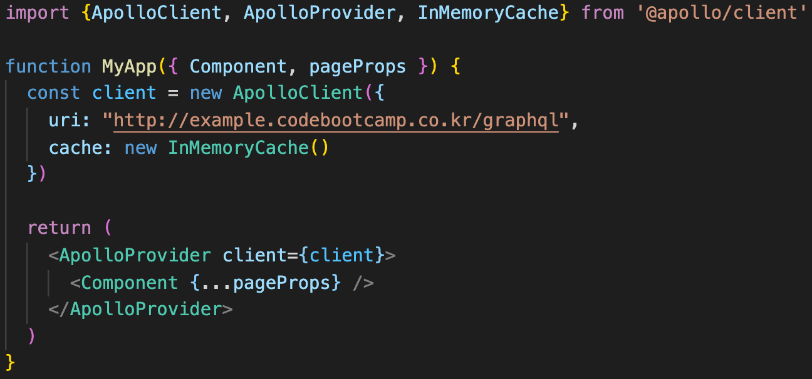
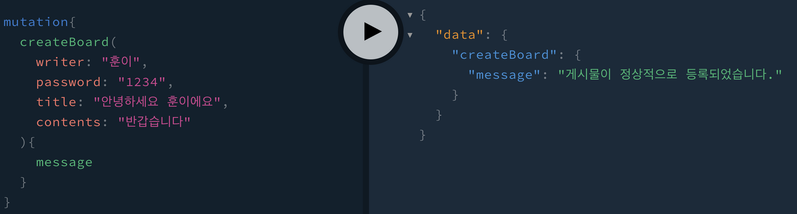
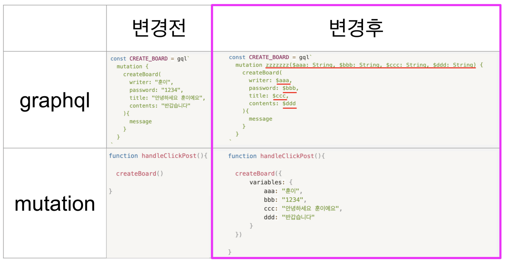

### 1. apollo-client로 graphql 뮤테이션 실행하기
~
0. apollo-client가 설치되었는지 _app.js에 들어가서 확인한다.


1. 뮤테이션을 사용하기 전, playground에서 내가 사용하려는 mutation이 제대로 작동하는지 확인한다.


2. 제대로 작동한다면, graphql을 실행하려는 페이지 상단에서 apollo-client 도구들을 불러온다.

```javascript

import { useMutation, gql } from '@apollo/client'

```

3. javascript 입력 부분에 playground의 코드를 복사하여 gql`` 안에 붙여넣어 변수 혹은 상수를 만들어준다.

```javascript

// graphql 코드 생성
const CREATE_BOARD = gql`
	mutation {
		createBoard(
			writer: "훈이",
			password: "1234",
			title: "안녕하세요 훈이에요",
			contents: "반갑습니다"
		){
			message
		}
	}
`

```

4. 위에서 만든 gql 변수/상수를 활용하여 useMutation을 만들어준다. (※ createBoard는 mutation을 실행하기 위한 이름으로, 아무 이름이나 붙여도 무관하다.)

```javascript

// mutation 코드 생성
const [createBoard] = useMutation(CREATE_BOARD)

```

5. 게시물 등록 버튼을 클릭했을 때 실행되는 함수에서 mutation 코드를 실행해준다.

```javascript

function handleClickPost(){

	createBoard({
			variables: {
					aaa: "훈이",
					bbb: "1234",
					ccc: "안녕하세요 훈이에요",
					ddd: "반갑습니다"
			}
	})
	return (
		<button onClick={handleClickPost}>게시물 등록</button>
	)
}

```

6. 그 런 데, 이렇게 하면 항상 같은 게시물이 등록된다. 따라서 3번의 CREATE_BOARD 부분이 변경되어야 한다.

graphql에 들어가는 데이터는 최종적으로 등록하기 버튼을 눌렀을 때 실행되는 handleClickPost 함수의 mutation에서 넣어주어야 한다.

7. 이렇게 해도 계속 똑같은 데이터만 들어가게 되는데, 들어가는 데이터를 고정된 값 대신 state로 변경하여 넣으면 최종적인 코드가 완성된닷!


#### 1.1. graphql 뮤테이션에 try~catch 적용하기

위와 같이 뮤테이션을 실행한다고 해도, 항상 성공하는 것은 아니다. 백엔드 컴퓨터에 문제가 있을 수도 잇고, 내가 수정하려는 게시물이 삭제되어 문제가 발생할 수도 있다. 

따라서, 우리는 성공에 대한 처리와 실패에 대한 처리를 나누어 작업해야 한다!!

```javascript
try {
		**await** createBoard({
				variables: {
						aaa: "훈이",
						bbb: "1234",
						ccc: "안녕하세요 훈이에요",
						ddd: "반갑습니다"
				}
		})

} catch(error) {
		alert(error.message)     // 경고창(실패했습니다.)  ==>  백엔드 개발자가 보내주는 실패 메시지
} finally {
	// 성공, 실패 여부와 상관없이 무조건 마지막에 실행되는 부분
	// 필요없다면 생략 가능
}
```

※ 객체의 key값과 value값이 같으면 각각 표기하지 않고 한 번만 표기하는데, 이것을 shorthand-property라 한다.

```javascript
const result = await createUseditem({
	variables: {
		createUseditemInput: {
			name         // name: myName
			remarks      // remarks: myRemarks
			contents    // contents: myContents
			},
		},
});
```