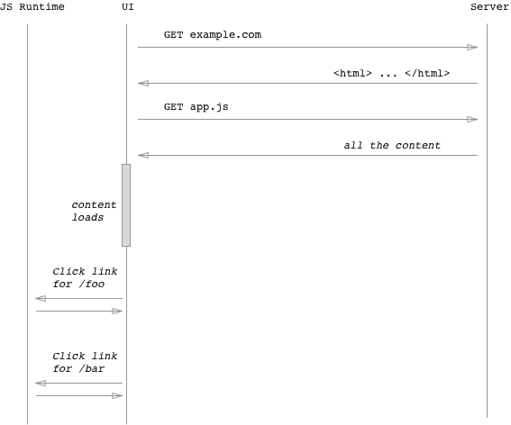
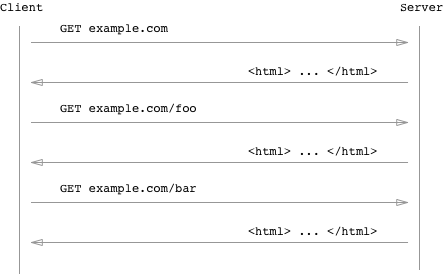

### 1. 라이브러리와 프레임워크

> React.js는 라이브러리이고, Next.js는 React.js의 프레임워크이다.

리액트와 넥스트의 차이점에 대해 알려면, 라이브러리와 프레임워크의 차이점부터 알아야 한다.

라이브러리와 프레임워크의 궁극적인 차이점은 **"응용 프로그램의 흐름 주도권을 누가 가지고 있느냐"**이다.

- **1) 라이브러리**

  - 어플리케이션을 만들 때 필요한 자원(기능: 함수)의 모임

  - 응용 프로그램이 라이브러리를 사용한다.

- **2) 프레임워크**

  - 코드를 작성하는 기본적인 틀을 제공해서 보다 효율적으로 어플리케이션을 만들 수 있도록 하는 소프트웨어 환경

  - 응용 프로그램은 프레임워크에 의해 사용된다.

 

=> React에서는 우리가 모든 것을 직접 생성하고 설정해 주었던 것들이 Next에서는 이미 만들어져 있다. 우리는 Next 규칙에 따라 코드만 작성하면 된다.

---

### 2. 리액트와 넥스트의 동작 방식, CSR vs. SSR

> CSR과 SSR은 유저가 브라우저에서 보는 화면인 "UI를 어디서 만들어 주는지"에 따라 구분한다.

`create-react-app`로 만든 React.js 앱은 CSR(Client-Side-Rendering)이고, `creat-next-app`로 만든 Nest.js 앱은 SSR(Server-Side-Rendering)이다.

CSR은 클라이언트(프론트)에서 화면을 구성하고, SSR은 서버(백)에서 화면을 구성한다.

 

#### 2.1. 리액트 동작 방식(CSR)

**1)** 유저가 브라우저를 통해 앱에 접속하면  
**2)** 앱은 브라우저에게 javascript 정보가 들어있는 빈 html 문서을 전달한다. (브라우저에게 javascript파일을 전달한다.)  
**3)** 브라우저는 javascript파일을 다운로드하고 동시에 유저는 **빈 화면**을 보게 된다(접속에 대한 응답).
**4)** 브라우저에서 js 파일의 다운로드가 끝나면, 리액트 코드가 있는 js파일을 실행한다.  
**5)** 브라우저에 있는 리액트 코드가 UI를 렌더링한다. (동적으로 렌더링)  
**6)** 유저는 드디어 앱이 보여주고자 했던 화면을 보게 된다.  

📌 즉, 브라우저가 javascript 코드를 가지고 있지 않거나, 요청 중인 상태라면 UI를 구성할 수 없고, 유저는 빈 화면을 보게 된다. **리액트 코드가 실행되기 전까지는 유저 화면에 아무것도 보이지 않는 것**이다. 이렇게 클라이언트 측에서 UI를 빌드하는 것을 CSR 방식이라 한다.

 

👍 장점

- 초기 로드만 완료되면 이후 렌더링이 빠르기 때문에 사용자 경험이 좋다.
- 서버에 요청하는 횟수가 적어 서버 부담이 적다. (data 필요할 때만 요청)
- Web Applications에 좋다.

 

👎 단점

- SEO에 좋지 않다. (초기 HTML 파일이 비어있기 때문에 봇이 데이터 수집하기 어려움. 구글 봇의 경우는 JS를 지원하지만, 다른 검색엔진의 경우 그렇지 않음)
- 초기 로드가 오래 걸린다.
- 외부 라이브러리가 필요한 경우가 많다.

 

#### 2.2. 넥스트 동작 방식(SSR)

**1)** 유저가 브라우저를 통해 앱에 접속하면,  
**2)** 서버에서 리액트를 실행한다.  
**2)** 리액트는 UI를 렌더링한다.  
**2)** 렌더링된 결과를 통해 브라우저에게 HTML을 제공한다. 이때 유저는 앱의 초기화면을 보게 된다(접속에 대한 응답).  
**2)** 이후 브라우저는 리액트 코드가 있는 Javascript 파일을 다운받고 실행시킨다. **이때부터 일반적인 리액트 앱과 같이 CSR의 동작(동적 렌더링)**을 하게 되고 이 과정을 hydration이라고 한다.  

📌 즉, 서버에서 UI를 모두 구성한 후 유저에게 응답해 화면을 보여주는 방식으로, 화면이 pre-rendering되어 유저는 인터넷 속도에 상관없이 화면에 뭔가 나오는 것을 볼 수 있다. 이렇게 서버 측에서 UI를 렌더링하는 것을 SSR 방식이라 한다.

\***hydration**: 리액트 코드가 브라우저에 이미 존재하는 HTML과 동기화하여 앱이 동적으로 상호작용할 수 있도록하는 과정

 

👍 장점

- SEO에 좋다. (HTML 파일에 모든 정보가 포함되어 있기 때문에 봇이 데이터 수집 가능)
- 초기 로딩 속도가 빠르다.
- Static sites에 좋다.

 

👎 단점

- 서버에서 전체 앱을 미리 렌더링하기 때문에 컴포넌트 로딩이 오래 걸리면 유저는 빈 화면을 볼 수도 있다.
- 서버에 매번 요청하기 때문에 서버 부하가 크다. (view 변경 시 요청)
- 페이지를 요청할 때마다 새로고침되어 사용자 경험이 다소 떨어진다. (브라우저가 페이지를 요청할 때마다 해당 페이지에 관련된 HTML, CSS, JS 파일 및 데이터를 받아와서 렌더링)
