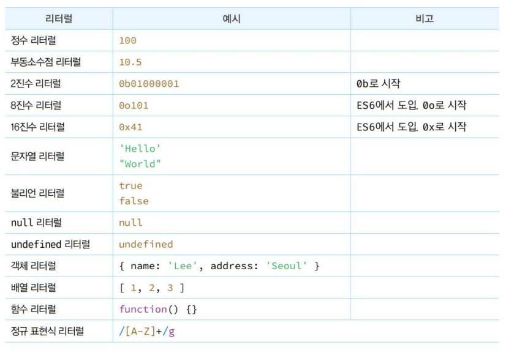
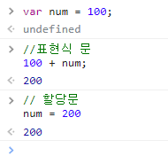

### 05장. 표현식과 문

#### 5.1. 값

값은 식(표현식)이 평가되어 생성된 결과를 말하고, 평가란 식을 해석해서 값을 생성하거나 참조하는것을 의미한다.

**예제 05-01**

```js
// 10 + 20은 평가되어 숫자 값 30을 생성한다.
10 + 20; // 30
```

변수는 하나의 값을 저장하기 위해 확보한 메모리 공간 자체 또는 그 메모리 공간을 식별하기 위해 붙인 이름, 변수에 할당되는 것은 값이다.

**예제 05-02**

```js
// 변수에는 10 + 20이 평가되어 생성된 숫자 값 30이 할당된다.
var sum = 10 + 20;
```

---

#### 5.2. 리터럴

리터럴은 사람이 이해할 수 있는 문자 또는 약속된 기호를 사용해 값을 생성하는 표기법을 말한다.



---

#### 5.3. 표현식

표현식은 값으로 평가될 수 있는 문이다. 즉, 표현식이 평가되면 새로운 값을 생성하거나 기존 값을 참조한다.

표현식은 리터럴, 식별자(변수, 함수 등의 이름), 연산자, 함수 호출 등의 조합으로 이뤄질 수 있다.

**예제 05-04**

```js
var score = 100;
```

위 예제에서 100은 리터럴이며, 리터럴 100은 자바스크립트 엔진에 의해 평가되어 값을 생성하므로 리터럴은 그 자체로 표현식이다.

**예제 05-05**

```js
var score = 50 + 50;
```

50 + 50은 리터럴과 연산자로 이뤄져 있다. 하지만 50 + 50도 평가되어 숫자 값 100을 생성하므로 표현식이다.

**예제 05-06**

```js
score; // 100
```

변수 식별자를 참조하면 변수 값으로 평가된다. 식별자 참조는 값을 생성하지는 않지만 값으로 평가되므로 표현식이다.

**예제 05-07**

```js
// 리터럴 표현식
10;
("Hello");

// 식별자 표현식(선언이 이미 존재한다고 가정)
sum;
person.name;
arr[1];

// 연산자 표현식
10 + 20;
sum = 10;
sum !== 10;

// 함수/메서드 호출 표현식(선언이 이미 존재한다고 가정)
square();
person.getName();
```

표현식은 값으로 정의된다. 이때 표현식과 표현식이 평가된 값은 동등한 관계, 즉 동치이다.

자바스크립트의 표현식 1 + 2는 평가되어 값 3을 생성하므로 표현식 1 + 2와 값 3은 동치이다. 따라서 표현식은 값처럼 사용할 수 있다.

문법적으로 값이 위치할 수 있는 자리에는 표현식도 위치할수 있다.

**예제 05-08**
var x = 1 + 2;
// 식별자 표현식 x는 3으로 평가된다.
x + 3; // -6

---

#### 5.4. 문

문은 프로그램을 구성하는 기본 단위이자 최소 실행 단위이며, 여러 토큰으로 구성된다.

토큰이란 문법적인 의미를 가지며, 문법적으로 더 이상 나눌 수 없는 코드의 기본 요소를 의미한다.

문은 선언문, 할당문, 조건문, 반복문 등으로 구분할 수 있다. (명령문이라고도 부른다.)

**예제 05-09**

```js
// 변수 선언문
var x;

// 표현식 문(할당문)
x = 5;

// 함수 선언문
function foo () {}

// 조건문
if (x 1) { console.log(x); }

// 반복문
for (var i = 0; i < 2; i++) { console.log(i); }
```

---

#### 5.5. 세미콜론과 세미콜론 자동 삽입 기능

세미콜론은 문의 종료를 나타낸다, 즉 자바스크립트 엔진은 세미콜론으로 문이 종료한 위치를 파악하고 순차적으로 하나씩 문을 실행한다.

단, 0개 이상의 문을 중괄호로 묶은 코드 블록(if 문, for 문, 함수) 뒤에는 세미콜론을 붙이지 않는다. 문의 종료를 의미하는 자체 종결성을 갖기 때문이다.

자바스크립트 엔진이 소스코드를 해석할 때 문의 끝이라고 예측되는 지점에 세미콜론을 자동으로 붙여주는 자동 삽입 기능이 암묵적으로 수행되기 때문에 생략이 가능하다.

하지만 세미콜론 자동 삽입 기능이 개발자의 예측과 일치하지 않는 경우가 간혹 있기 때문에 세미 콜론을 붙이는것을 권장한다. (ESLint 에서도 세미 콜론 사용을 기본으로 설정하고 있다.)

**예제 05-10**

```js
function foo() {
  return;
  {
  }
  // ASI의 동작 결과 => return; {};
  // 개발자의 예측 => return {};
}
console.log(foo()); // undefined

var bar = (function () {})(function () {})();
// ASI의 동작 결과 => var bar = function () {}(function() {})();
// 개발자의 예측 => var bar = function () {}; (function() {})();
// TypeError: (intermediate value)(...) is not a function
```

---

#### 5.6. 표현식인 문과 표현식이 아닌 문

**예제 05-11**

```js
// 변수 선언문은 값으로 평가될 수 없으므로 표현식이 아니다.
var x;
// 1, 2, 1 + 2, x = 1 + 2는 모두 표현식이다.
// x = 1 + 2는 표현식이면서 완전한 문이기도 하다.
x = 1 + 2;
```

표현식인 문과 표현식이 아닌 문을 구별하는 가장 간단하고 명료한 방법은 변수에 할당해 보는 것이다.

**예제 05-12**

```js
// 표현식이 아닌 문은 값처럼 사용할 수 없다.
var foo = var x; // SyntaxError: Unexpected token var
```

**예제 05-13**

```js
// 변수 선언문은 표현식이 아닌 문이다.
var x;
// 할당문은 그 자체가 표현식이지만 완전한 문이기도 하다. 즉, 할당문은 표현식인 문이다.
x = 100;
```

**예제 05-14**

```js
// 표현식인 문은 값처럼 사용할 수 있다
var foo = (x = 100);
console.log(foo); // 100
```

할당문을 값처럼 변수에 할당했다. 즉, x = 100은 x 변수에 할당한 값 100으로 평가된다. 따라서 foo 변수에는 100이 할당된다.


개발자 도구에서 표현식이 아닌 문을 실행하면 언제나 undefined를 출력한다. 이를 완료값이라고 한다.



반대로 표현식인 문을 실행하면 평가된 값을 반환한다.
