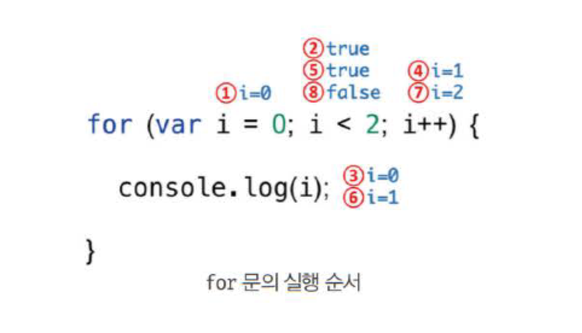
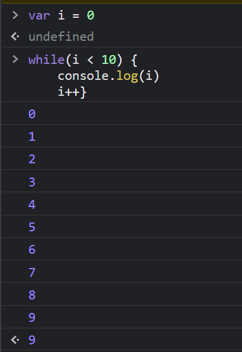

### 📸 즐거운 스터디!


### 08장. 제어문

- 조건에 따라 코드 블록을 실행하거나 반복 실행 할 때 사용한다.
- 일반적으로 위에서 아래 방향으로 실행되지만, 제어문을 사용하면 인위적으로 코드의 실행 흐름을 제어할 수 있다.

---

#### 8.1. 블록문

- 블록문이란 **0개 이상의 문을 중괄호로 묶은 것**이다. 코드 블록 또는 블록이라고 부른다.
- 단독으로 사용할 수 있지만 일반적으로 제어문이나 함수를 정의할 때 사용한다.
- 블록문은 항상 문의 종료를 의미하기 때문에 일반적으로 세미콜론을 붙이지 않는다.

---

#### 8.2. 조건문

- 주어진 조건식의 평가 결과에 따라 코드 블록의 실행을 결정한다.
- 조건식은 불리언 값으로 평가될 수 있는 표현식이다.

##### 8.2.1. if-else문

- 조건식의 평가 결과가 true일 경우, if문의 코드 블록이 실행되고, false일 경우, else문의 코드 블록이 실행된다.
- 조건식의 평가값이 불리언 값이 아니라면 불리언 값으로 암묵적 타입 변환이 되어 실행할 코드 블록을 결정한다.

```javascript
if (조건식) {
  // 조건식의 실행 결과가 true일 경우 실행되는 코드 블록
} else {
  // 조건식의 실행 결과가 false일 경우 실행되는 코드 블록
}
```

- else if문을 여러번 사용하여 여러개의 조건을 사용 할 수 있다.

```javascript
if (조건식1) {
  ...
} else if (조건식2) {
  ...
} else {

}
```

##### 8.2.2. switch문

- switch문은 주어진 표현식을 평가하여 그 값과 일치하는 표현식을 갖는 case문으로 실행 흐름을 옮긴다.
- 만약 일치하는 case문이 없다면 default문으로 이동한다. 이 때, default문은 생략할 수 있다.
- 주의할 점은 일치한 case문으로 이동하여 실행한 이후 switch문을 탈출하지 않고 끝날 때 까지 실행된 case문 이후 코드들을 실행(이를 fall through,폴스루)하기 때문에, 원하는 case문만 실행하고 싶다면 case문 안에 break를 사용해야한다.

```javascript
// fall through 예시

switch (1) {
  case 0:
    0번 코드
  case 1:
    1번 코드
  case 2:
    2번 코드
}

// 1번 코드, 2번 코드 모두 실행된다.
```

```javascript
// 원하는 case문만 실행하고 싶다면! break를 작성하자!

  switch (1) {
  case 0:
    0번 코드
  case 1:
    1번 코드
    break;
  case 2:
    2번 코드
}

// 1번 코드만 실행된다.
```

---

#### 8.3. 반복문

- 조건식의 평가 결과가 참인 경우 코드 블록을 실행하며, 조건식이 거짓일 때까지 반복된다.

##### 8.3.1. for문

- for문은 조건식이 거짓으로 평가될 때까지 코드 블록을 반복 실행한다.
- for문의 구조는 아래와 같다.

```javascript
for (변수 선언문 or 할당문; 조건식; 증감식) {
  // 조건식이 참일 경우 반복 실행될 문
  }
```

- for문의 변수 선언문, 조건식, 증감식은 모두 옵션이지만, 모두 생략하게 되면 무한루프가 되기 때문에 주의해야한다.

- for문의 실행 순서는 아래 이미지를 통해 이해하자.
  

##### 8.3.2. while문

- 주어진 조건식의 평가 결과가 참이면 코드 블록을 계속 반복 실행한다.
- while문의 구조는 아래와 같다.

```javascript
while (조건식) {
  ...
}
```

- while문의 간단한 예제를 실행시켜보았다.
  

##### 8.3.3. do-while문

- 코드 블록을 먼저 실행하고 조건식을 평가한다.
- 따라서 조건식의 실행 결과가 무엇이든 무조건 한번은 코드 블록이 실행된다.

```javascript
do {
  console.log("꽉잡아스크립트 화이탱"); // "꽉잡아스크립트 화이탱" 한 번 출력됨
} while (false);
```

---

#### 8.4. break문

- 코드 블록을 탈출하는 기능이 있다. switch문과 반복문 안에서 사용할 수 있다.
- `break;`만 쓰면 가장 가까운 코드 블록을 탈출한다.
- `break 레이블명;`은 여러 개의 중첩 반복문을 종료할 때 유용하다.
- 레이블이란 식별자가 붙은 문을 뜻한다.
- 아래의 예시를 보면 쉽게 이해할 수 있다.


- `break foo`를 통해 foo 레이블 블록문을 탈출해서, console에 2는 찍히지 않고 바로 Done!이 나온 것!

---

#### 8.5. continue문

- 반복문의 코드 블록 실행을 중단 시킨다.
- break문처럼 반복문을 탈출하지는 않고, 그 당시 조건만 중단시키고 다음 조건으로 넘어간다.

```javascript
for (let i = 0; i < 3; i++) {
  if (i === 1) {
    continue;
  }

  console.log(i); // 0, 2
}
```
