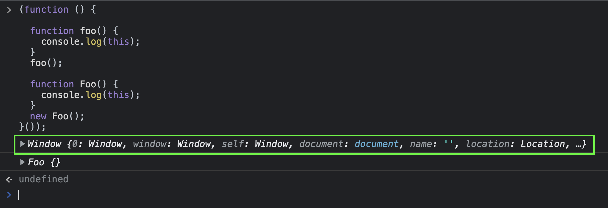

### 📸 즐거운 스터디!


### 20장. strict mode

#### 20.1. strict mode란?

> ES5 에서 소개된 JavaScript 의 엄격모드는 JavaScript 의 제한된 버전을 선택하여 암묵적인 "느슨한 모드(sloppy mode)"를 해제하기 위한 방법입니다.
> [MDN](https://developer.mozilla.org/ko/docs/Web/JavaScript/Reference/Strict_mode)

`strict mode` 는 자바스크립트 언어의 문법을 **좀 더 엄격히 적용하여** 오류를 발생시킬 가능성이 높거나 자바스크립트 엔진의 최적화 작업에 문제를 일으킬 수 있는 코드에 대해 **명시적인 에러**를 발생시킨다.

- `ESLint` 를 사용해도 strict mode와 유사한 효과를 얻을 수 있다.

- `ESLint` 는 정적 분석 기능을 통해 소스코드를 실행하기 전에 스캔하여 문법적 오류뿐만 아니라 잠재적 오류까지 찾아내고 오류의 원인을 리포팅해준다.

> ES6에서 도입된 클래스와 모듈은 기본적으로 strict mode가 적용된다.

<br>

---

#### 20.2. strict mode의 적용

`strict mode` 를 적용하려면 전역의 선두 또는 함수 몸의 선두에 `'use strict';`를 추가한다. (또는 `"use strict";`)

```js
"use strict";

function foo() {
  x = 10; // ReferenceError: x is not defined
}
foo();
```

<br>

함수 몸체 선두에 추가하면 해당 함수와 중첩 함수에 `strict mode`가 적용된다.

```html
function foo() { "use strict"; x = 10; // ReferenceError: x is not defined }
foo();
```

<br>

코드 선두에 `'use strict';`를 위치시키지 않으면 `strict mode`가 작동하지 않는다.

```js
function foo() {
  x = 10; // 에러를 발생시키지 않는다.
  ("use strict");
}
foo();
```

<br>

---

#### 20.3. 전역에 strict mode를 적용하는 것은 피하자

전역에 적용한 strict mode는 `스크립트 단위`로 적용된다.

```html
<!DOCTYPE html>
<html>
  <body>
    <script>
      "use strict";
    </script>
    <script>
      x = 1; // 에러가 발생하지 않는다.
      console.log(x); // 1
    </script>
    <script>
      "use strict";

      y = 1; // ReferenceError: y is not defined
      console.log(y);
    </script>
  </body>
</html>
```

- 스크립트 단위로 적용된 strict mode는 다른 스크립트에 영향을 주지 않고 해당 스크립트에 한정되어 적용된다.

- strict mode 스크립트와 non-strict mode **스크립트를 혼용하는 것은 오류를 발생시킬 수 있다.** 특히 **외부 서드파티 라이브러리**를 사용하는 경우 라이브러리가 non-strict mode인 경우도 있기 때문에 전역에 strict mode를 적용하는 것은 바람직하지 않다.

- 이러한 경우 `즉시 실행 함수`로 스크립트 전체를 감싸서 **스코프를 구분**하고 즉시 실행 함수의 선두에 strict mode를 적용한다.

```js
// 즉시 실행 함수의 선두에 strict mode 적용
(function () {
  "use strict";

  // Do something...
})();
```

<br>

---

#### 20.4. 함수 단위로 strict mode를 적용하는 것도 피하자

- `함수 단위`로도 strict mode를 적용할 수 있다.
- 하지만, 함수마다 strict mode를 적용하는 여부를 다르게 하는 것은 바람직하지 않으며 모든 함수에 일일이 적용하는 것은 번거로운 일이다.

```js
(function () {
  // non-strict mode
  var lеt = 10; // 에러가 발생하지 않는다.

  function foo() {
    "use strict";

    let = 20; // SyntaxError: Unexpected strict mode reserved word
  }
  foo();
})();
```

> 따라서 strict mode는 즉시 실행 함수로 감싼 스크립트 단위로 적용하는 것이 바람직하다.

<br>

---

#### 20.5. strict mode가 발생시키는 에러

##### 20.5.1. 암묵적 전역

- 선언하지 않은 변수를 참조하면 `ReferenceError`가 발생한다.

```js
(function () {
  "use strict";

  x = 1;
  console.log(x); // ReferenceError: x is not defined
})();
```

<br>

##### 20.5.2. 변수, 함수, 매개변수의 삭제

- `delete` 연산자로 변수, 함수, 매개변수를 삭제하면 `SyntaxError`가 발생한다.

```js
(function () {
  "use strict";

  var x = 1;
  delete x;
  // SyntaxError: Delete of an unqualified identifier in strict mode.
  // unqualified identif: ier정규화되지 않은 식별자

  function foo(a) {
    delete a;
    // SyntaxError: Delete of an unqualified identifier in strict mode.
  }
  delete foo;
  // SyntaxError: Delete of an unqualified identifier in strict mode.
})();
```

<br>

##### 20.5.3. 매개변수 이름의 중복

- 중복된 매개변수 이름을 사용하면 `SyntaxError`가 발생한다.

```js
(function () {
  "use strict";

  //SyntaxError: Duplicate parameter name not allowed in this context
  function foo(x, x) {
    return x + x;
  }
  console.log(foo(1, 2));
})();
```

<br>

##### 20.5.4. with 문의 사용

- `with` 문을 사용하면 `SyntaxError`가 발생한다. `with` 문은 전달된 객체를 스코프 체인에 추가한다.

```js
// 형식
// 명령문의 스코프 체인을 확장해주는 구문
// 특정 객체를 여러 번 사용하는 경우 객체명을 생략할 수 있도록 도와줌
with (Expression) {
  statement;
}
```

- `with` 문은 동일한 객체의 프로퍼티를 반복해서 사용할 때 객체 이름을 생략할 수 있어서 코드가 간단해지는 효과가 있지만 성능과 가독성이 나빠지는 문제가 있다.

```js
(function () {
  "use strict";

  // SyntaxError: Strict mode code may not include a with statement
  with ({ x: 1 }) {
    console.log(x);
  }
})();
```

> with 를 사용하는 것은 권장하지 않으며, ECMAScript 5 strict mode에서는 금지되어 있습니다. 임시 변수에 액세스 하려는 속성이 있는 객체를 할당하는 것이 좋습니다.
> [MDN](https://developer.mozilla.org/ko/docs/Web/JavaScript/Reference/Statements/with)

<br>

---

#### 20.6. strict mode 적용에 의한 변화

##### 20.6.1. 일반 함수의 this

- `strict mode`에서 함수를 일반 함수로서 호출하면 `this`에 `undefined`가 바인딩된다.
- 생성자 함수가 아닌 일반 함수 내부에서는 this를 사용할 필요가 없기 때문이다.

```js
(function () {
  "use strict";

  function foo() {
    console.log(this); // undefined
  }
  foo();

  function Foo() {
    console.log(this); // Foo
  }
  new Foo();
})();
```



- `'use strict';`가 없으면 `this`는 `전역객체`를 가리킨다.

- `'use strict';` 을 적용하면 `this`가 `전역객체`로 바인딩하는 `foo() 함수` 의 문제점을 `strict mode`가 막아준다.

<br>

##### 20.6.2. arguments 객체

- `strict mode`에서는 매개변수에 전달된 인수를 재할당하여 변경해도 `arguments` 객체에 반영되지 않는다.

- `arguments`: 함수에 전달된 인수에 해당하는 Array 형태의 객체
  [MDN](https://developer.mozilla.org/ko/docs/Web/JavaScript/Reference/Functions/arguments)

```js
(function (a) {
  "use strict";
  // 매개변수에 전달된 인수를 재할당하여 변경
  a = 2;

  // 변경된 인수가 arguments 객체에 반영되지 않는다.
  console.log(arguments); // { 0: 1, length: 1 }
})(1);
```
