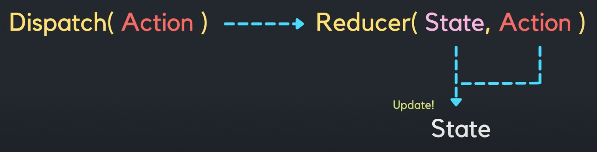

### 1. reducer, dispatch, action

컴포넌트의 스테이트를 생성하고 관리하기 위해서 지금까지 useState 훅을 사용해왔다. 리액트에서 스테이트 관리를 위한 또 다른 훅이 있다. useReducer 훅이다. useReducer도 스테이트를 생성하고 관리할 수 있게 하는 도구이다. 그렇다면 useReducer는 언제 사용하는 걸까?
<br>
다음과 같이 여러 개의 하위 값을 포함하는 복잡한 스테이트를 다룰 때 useState 대신 useReducer를 사용하면 더 편리하고 깔끔하게 코드를 작성할 수 있고 유지보수도 편해진다.

```js
{
  teacher: "James",
  students: ["Kim", "Ann", "John"],
  count: 3,
  locations: [
    { country: "Korea", name: "A" },
    { country: "Austrailia", name: "B" },
  ],
};
```

<br>

useReducer를 사용하기 전에 알아둬야 할 것이 세 가지 있다.

> **1) Reducer, 2) Dispatch, 3) Action**이다.

<br>

예를 들어, 은행에 가서 만원을 출금하고 싶은 상황으로 이해해보자. 그치만 내가 직접 거래내역을 업데이트 시키지 않고, 은행에서 업데이트를 해준다. 내가 할 일은 은행에게 만원을 출금해달라고 요구를 하는 것이다. 은행이 내 요구에 따라 내역을 업데이트 시켜준다.

이때 거래내역은 state가 된다. 이 거래내역이라는 state는 내가 직접 수정하지 않고, 은행이 나의 요구대로 대신 업데이트 해준다. 여기서 이 '은행'을 Reducer라고 할 수 있다.

<br>

**Reducer는 스테이트를 업데이트 해주는 역할**을 한다.

컴포넌트의 스테이트를 업데이트하고 싶다면, 꼭 이 Reducer를 통해서 해야 한다. 마치 내가 거래내역 업데이트를 직접 할 수 없고 은행이 대신 해주어야 하는 것과 같다.

<br>

나는 **은행에게 업데이트를 해달라고 '요구'만 할 수 있는데, 이 요구 행위를 바로 Dispatch**라고 한다. 그리고 나는 **이 요구 안에 '만원을 출금해주세요'라는 내용을 전달하게 되는데, 이 내용을 바로 'Action'**이라 한다.

<br>

> 정리하자면, 내가 거래내역이라는 스테이트를 업데이트 하기 위해선 요구라는 Dispatch에 '만원을 출금해주세요'라는 내용의 Action을 담아서 은행이라는 Reducer에 전달해주어야 한다.

그러면 Reducer는 Action의 내용대로 스테이트를 업데이트 시켜준다. 나는 Reducer에게 송금, 입금 등의 다른 Action들을 보냄으로써 복잡한 일들을 할 수 있다. Action에 담겨 있는대로 알아서 처리해주기 때문에 복잡한 작업을 할 때는 Reducer가 짱이다.



컴포넌트의 관점으로 보자면, 스테이트를 업데이트 시켜주기 위해서는 Dispatch 함수의 인자로 Action을 넣어서 Reducer에게 전달해주는 것이다. 그러면 Reducer가 컴포넌트의 스테이트를 Action안에 들어가 있는 내용대로 업데이트 시켜주는 것이다.

<br>

---

<br>

### 2. useReducer()의 구조

```js
import { useState, useReducer } from "react";

// reducer - state를 업데이트 하는 역할
// dispatch - state 업데이트를 위한 요구
// action - 그 요구의 내용

const reducer = (state, action) => {
  console.log("reducer가 일을 합니다", state, action);
  return state + action.payload;
};

const App = () => {
  const [number, setNumber] = useState(0);
  const [money, dispatch] = useReducer(reducer, 0);

  return (
    <div>
      <h2>useReducer 은행에 오신 것을 환영합니다</h2>
      <p>잔고 {money}원</p>
      <input
        type="number"
        value={number}
        onChange={(e) => {
          setNumber(parseInt(e.target.value));
        }}
        step="1000"
      />
      <button
        onClick={() => {
          dispatch({ type: "deposit", payload: number });
        }}
      >
        예금
      </button>
      <button>출금</button>
    </div>
  );
};

export default App;
```

useReducer는 useState와 마찬가지로 배열을 하나 반환해준다. 배열의 첫 번째 요소에는 새로 만들어둔 스테이트인 money가 들어 있고, 두 번째 요소에는 useReducer가 만들어준 dispatch 함수가 들어 있다.

> useReducer 함수는 두 가지 인자를 받는다. 첫 번째 인자로는 reducer를 받고, 두 번째 인자로는 money 스테이트 안에 들어갈 초기값을 받는다.

> 컴포넌트 밖에 선언된 reducer 함수는 첫 번째 인자로 스테이트를, 두 번째 인자로 action을 받는다. 첫 번째 인자인 스테이트 안에는 reducer 함수가 불리는 시점에 money 스테이트 안에 들어가 있는 값이 들어가게 된다. action은 reducer에게 스테이트를 변경해달라고 요구할 때 그 요구에 대한 내용이 들어가게 된다.

money 스테이트는 useReducer로 생성되었고, reducer 함수를 통해서만 수정된다. 그 reducer는 useReducer의 첫 번째 인자로 전달이 되었다.

reducer 함수로 money 스테이트를 수정하고 싶을 때마다, dispatch를 불러줄 것이다. dispatch는 useReducer가 만들어준 함수인데, 인자로 action을 넣어서 사용한다. 이 dispatch 함수를 호출하면 reducer가 호출되고, reducer의 인자로 action이 전달된다. 그러면 그 action을 토대로 reducer는 state를 변경시켜준다.

예금 버튼을 클릭해서 money 스테이트를 수정해보자. 그럼 버튼에 dispatch 함수를 달아주면 된다. dispatch의 인자로 action이 객체 형태로 보내게 된다. 요구 내용인 action 객체에는 type과 payload를 키로 넣어준다. 각각 '무엇을 누구에게' 해줄 것인지 요청하는 내용으로 이해하면 된다.

reducer가 리턴하는 값은 새로 업데이트될 스테이트가 되는 것이다. 잔고에는 현재 money의 값에 input의 값을 더한 값이 나와야 하므로 `state + action.payload`을 리턴해주면 된다.

<br>

그런데 예금 말고 출금도 하고 싶다면? dispatch로 action을 보낼 때 다른 type으로 보내주면 되고, reducer 함수에서는 상황에 따라 다른 계산을 해서 값을 리턴해주어야 한다. 그래서 보통 reducer 안에 `if ... else`문이나 `switch`문을 많이 쓴다.

연습삼아 switch문을 사용해보자.

```js
import { useState, useReducer } from "react";

// reducer - state를 업데이트 하는 역할
// dispatch - state 업데이트를 위한 요구
// action - 그 요구의 내용

const reducer = (state, action) => {
  console.log("reducer가 일을 합니다", state, action);
  switch (action.type) {
    case "deposit":
      return state + action.payload;
    case "withdraw":
      return state - action.payload;
    default:
      return state;
  }
};

const App = () => {
  const [number, setNumber] = useState(0);
  const [money, dispatch] = useReducer(reducer, 0);

  return (
    <div>
      <h2>useReducer 은행에 오신 것을 환영합니다</h2>
      <p>잔고 {money}원</p>
      <input
        type="number"
        value={number}
        onChange={(e) => {
          setNumber(parseInt(e.target.value));
        }}
        step="1000"
      />
      <button
        onClick={() => {
          dispatch({ type: "deposit", payload: number });
        }}
      >
        예금
      </button>
      <button
        onClick={() => {
          dispatch({ type: "withdraw", payload: number });
        }}
      >
        출금
      </button>
    </div>
  );
};

export default App;
```

`action.type`에 따라 다른 연산을 해서 값을 리턴해준다. 예금과 출금이 제대로 작동하는 것을 확인할 수 있다.

코드를 조금 더 다듬어보자.

```js
import { useState, useReducer } from "react";

// reducer - state를 업데이트 하는 역할
// dispatch - state 업데이트를 위한 요구
// action - 그 요구의 내용

const ACTION_TYPES = {
  deposit: "deposit",
  withdraw: "withdraw",
};

const reducer = (state, action) => {
  console.log("reducer가 일을 합니다", state, action);
  switch (action.type) {
    case ACTION_TYPES.deposit:
      return state + action.payload;
    case ACTION_TYPES.withdraw:
      return state - action.payload;
    default:
      return state;
  }
};

const App = () => {
  const [number, setNumber] = useState(0);
  const [money, dispatch] = useReducer(reducer, 0);

  return (
    <div>
      <h2>useReducer 은행에 오신 것을 환영합니다</h2>
      <p>잔고 {money}원</p>
      <input
        type="number"
        value={number}
        onChange={(e) => {
          setNumber(parseInt(e.target.value));
        }}
        step="1000"
      />
      <button
        onClick={() => {
          dispatch({ type: ACTION_TYPES.deposit, payload: number });
        }}
      >
        예금
      </button>
      <button
        onClick={() => {
          dispatch({ type: ACTION_TYPES.withdraw, payload: number });
        }}
      >
        출금
      </button>
    </div>
  );
};

export default App;
```

ACTION_TYPES라는 상수에 객체를 할당하고, 프로퍼티 키와 밸류를 작성해주고 switch문의 case 부분과 onClick 함수에 문자열로 되어있던 부분을 변경해주면 보다 깔끔하고, 오타 등으로 인한 오류가 덜 생긴다.

사실 위와 같이 단순한 money 스테이트를 가진 예제에서는 그냥 useState를 쓰는 게 깔끔할 수 있다. 나는 또 그냥 코드만 길고 복잡하게 짠 사람이 되어버렸다..

복잡한 스테이트 예시로 useReducer의 활용법을 더 알아보자.

<br>

---

<br>

### 3. useReducer 예제 2

출석부 앱에 이름을 입력하고 추가를 누르면 이름이 화면에 추가되고, 총 학생수가 늘어나며, 삭제하면 학생수도 줄어들며 화면에서 이름도 사라지도록 해보자. 이름을 클릭해서 이름에 중간선이 가게 되면 출석했다는 의미이다. 즉, 이 앱에서 제공하는 기능은 세 가지다.

- 출석부에 이름 추가하기 (+ 총 학생수 올리기)
- 출석 체크하기(이름에 중간선), 출석 취소하기(중간선 제거)
- 출석부에서 이름 지우기 (+ 총 학생수 내리기)

**App 컴포넌트**

```js
import { useState, useReducer } from "react";
import Student from "./Student";

const reducer = (state, action) => {
  switch (action.type) {
    case "add-student":
      const name = action.payload.name;
      const newStudent = {
        id: Date.now(),
        name,
        isHere: false,
      };
      return {
        count: state.count + 1,
        students: [...state.students, newStudent],
      };
    default:
      return state;
  }
};

const initialState = {
  count: 0,
  students: [],
};

const App = () => {
  const [name, setName] = useState("");
  const [studentsInfo, dispatch] = useReducer(reducer, initialState);

  return (
    <div>
      <h1>출석부</h1>
      <p>총 학생 수: {studentsInfo.count}</p>
      <input
        type="text"
        placeholder="이름을 입력해주세요"
        value={name}
        onChange={(e) => setName(e.target.value)}
      />
      <button
        onClick={() => {
          dispatch({ type: "add-student", payload: { name } });
        }}
      >
        추가
      </button>
      {studentsInfo.students.map((student) => {
        return <Student key={student.id} name={student.name} />;
      })}
    </div>
  );
};

export default App;
```

**Student 컴포넌트**

```js
const Student = ({ name }) => {
  return (
    <div>
      <span>{name}</span>
      <button>삭제</button>
    </div>
  );
};

export default Student;
```

학생을 추가하려면 studentsInfo 스테이트를 변경시켜주려는 것이기 때문에 reducer 함수를 이용해야 한다. 즉, studentsInfo 안에 들어 있는 students 배열에다가 학생을 넣어주면 된다.

추가 버튼에 onClick을 달아주자. onClick은 dispatch를 부르고, dispatch 안에 action 객체가 들어간다. 무엇을 누구에게 해줄 것인지, 즉 add-student를 { name }(input 값을 객체로 만듦)에게 해줄 것이다.

reducer 함수에서는 action.type에 따라 반환해줄 값을 달리하도록 만들었다. 타입이 add-student일 때 payload에서 이름을 받아서 지역변수인 name에 할당해주고, name를 newStudent라는 객체에 담아 새로운 students 배열을 리턴해준다. 그리고 studentsInfo.count를 state.count로 받아서 count도 업데이트 해준다. default도 설정해준다. 만약 조건에 맞지 않으면 기존의 스테이트를 리턴해주도록!

이제 삭제도 해주자.

그럼 자식 컴포넌트인 Student 컴포넌트에서 props로 dispatch와 학생의 id도 받아와야 한다. 그래야 삭제 버튼을 사용할 수 있다.

**App 컴포넌트**

```js
import { useState, useReducer } from "react";
import Student from "./Student";

const reducer = (state, action) => {
  switch (action.type) {
    case "add-student":
      const name = action.payload.name;
      const newStudent = {
        id: Date.now(),
        name,
        isHere: false,
      };
      return {
        count: state.count + 1,
        students: [...state.students, newStudent],
      };
    case "delete-student":
      return {
        count: state.count - 1,
        students: state.students.filter(
          (student) => student.id !== action.payload.id
        ),
      };
    default:
      return state;
  }
};

const initialState = {
  count: 0,
  students: [],
};

const App = () => {
  const [name, setName] = useState("");
  const [studentsInfo, dispatch] = useReducer(reducer, initialState);

  return (
    <div>
      <h1>출석부</h1>
      <p>총 학생 수: {studentsInfo.count}</p>
      <input
        type="text"
        placeholder="이름을 입력해주세요"
        value={name}
        onChange={(e) => setName(e.target.value)}
      />
      <button
        onClick={() => {
          dispatch({ type: "add-student", payload: { name } });
        }}
      >
        추가
      </button>
      {studentsInfo.students.map((student) => {
        return (
          <Student
            key={student.id}
            name={student.name}
            dispatch={dispatch}
            id={student.id}
          />
        );
      })}
    </div>
  );
};

export default App;
```

**Student 컴포넌트**

```js
const Student = ({ name, dispatch, id }) => {
  return (
    <div>
      <span>{name}</span>
      <button
        onClick={() => {
          dispatch({ type: "delete-student", payload: { id } });
        }}
      >
        삭제
      </button>
    </div>
  );
};

export default Student;
```

reducer 함수의 switch문에 "delete-student" 케이스를 추가해주고, Student 컴포넌트의 삭제 버튼이 눌리면 students 배열에서 배열의 요소인 객체들 중 student.id가 action.payload.id와 다른 것만 남도록 만든다. 즉 student.id가 action.payload.id와 같다면 삭제한다.

이제 출석 체크를 해보자!

**Student 컴포넌트**

```js
const Student = ({ name, dispatch, id, isHere }) => {
  return (
    <div>
      <span
        style={{
          textDecoration: isHere ? "line-through" : "none",
          color: isHere ? "gray" : "black",
        }}
        onClick={() => {
          dispatch({ type: "mark-student", payload: { id } });
        }}
      >
        {name}
      </span>
      <button
        onClick={() => {
          dispatch({ type: "delete-student", payload: { id } });
        }}
      >
        삭제
      </button>
    </div>
  );
};

export default Student;
```

isHere를 프롭스로 넘겨주고, Student 컴포넌트에서 isHere가 true일 때 중간선이 그어지면서 폰트 색상을 회색으로, false일 때는 중간선이 없고 폰트 색상이 검정색이 되도록 span 태그에 스타일을 지정해준다. 그리고 눌렀을 때 출석을 체크하고 해제하도록 dispatch를 반환하게 해준다. dispatch 함수의 인자인 action 객체에 "mark-student" 타입과 id가 들어있는 객체를 payload로 보내준다.

```js
import { useState, useReducer } from "react";
import Student from "./Student";

const reducer = (state, action) => {
  switch (action.type) {
    case "add-student":
      const name = action.payload.name;
      const newStudent = {
        id: Date.now(),
        name,
        isHere: true,
      };
      return {
        count: state.count + 1,
        students: [...state.students, newStudent],
      };
    case "delete-student":
      return {
        count: state.count - 1,
        students: state.students.filter(
          (student) => student.id !== action.payload.id
        ),
      };
    case "mark-student":
      return {
        count: state.count,
        students: state.students.map((student) => {
          if (student.id === action.payload.id) {
            return { ...student, isHere: !student.isHere };
          }
          return student;
        }),
      };
    default:
      return state;
  }
};

const initialState = {
  count: 0,
  students: [],
};

const App = () => {
  const [name, setName] = useState("");
  const [studentsInfo, dispatch] = useReducer(reducer, initialState);

  return (
    <div>
      <h1>출석부</h1>
      <p>총 학생 수: {studentsInfo.count}</p>
      <input
        type="text"
        placeholder="이름을 입력해주세요"
        value={name}
        onChange={(e) => setName(e.target.value)}
      />
      <button
        onClick={() => {
          dispatch({ type: "add-student", payload: { name } });
        }}
      >
        추가
      </button>
      {studentsInfo.students.map((student) => {
        return (
          <Student
            key={student.id}
            name={student.name}
            dispatch={dispatch}
            id={student.id}
            isHere={student.isHere}
          />
        );
      })}
    </div>
  );
};

export default App;
```

다시 App 컴포넌트로 돌아와서, switch문에서 action.type이 mark-student일 때 출석체크를 해도 총 학생수에는 변화가 없기 때문에 count는 그대로 state.count로 유지되고, students 배열을 map으로 돌면서 student.id가 action.payload.id와 같을 때만 isHere를 !studemt.isHere로 바꿔준다.

그러면 출석부에 이름 추가, 삭제, 출석체크 기능이 모두 정상 작동하는 것을 볼 수 있다.

조금 더 유지보수가 쉬운 코드를 위해 ACTION_TYPES라는 상수에 action 타입들을 정리할 수 있다.

**App 컴포넌트**

```js
import { useState, useReducer } from "react";
import Student from "./Student";

const ACTION_TYPES = {
  add: "add-student",
  delete: "delete-student",
  mark: "mark-student",
};

const reducer = (state, action) => {
  switch (action.type) {
    case ACTION_TYPES.add:
      const name = action.payload.name;
      const newStudent = {
        id: Date.now(),
        name,
        isHere: true,
      };
      return {
        count: state.count + 1,
        students: [...state.students, newStudent],
      };
    case ACTION_TYPES.delete:
      return {
        count: state.count - 1,
        students: state.students.filter(
          (student) => student.id !== action.payload.id
        ),
      };
    case ACTION_TYPES.mark:
      return {
        count: state.count,
        students: state.students.map((student) => {
          if (student.id === action.payload.id) {
            return { ...student, isHere: !student.isHere };
          }
          return student;
        }),
      };
    default:
      return state;
  }
};

const initialState = {
  count: 0,
  students: [],
};

const App = () => {
  const [name, setName] = useState("");
  const [studentsInfo, dispatch] = useReducer(reducer, initialState);

  return (
    <div>
      <h1>출석부</h1>
      <p>총 학생 수: {studentsInfo.count}</p>
      <input
        type="text"
        placeholder="이름을 입력해주세요"
        value={name}
        onChange={(e) => setName(e.target.value)}
      />
      <button
        onClick={() => {
          dispatch({ type: ACTION_TYPES.add, payload: { name } });
        }}
      >
        추가
      </button>
      {studentsInfo.students.map((student) => {
        return (
          <Student
            ACTION_TYPES={ACTION_TYPES}
            key={student.id}
            name={student.name}
            dispatch={dispatch}
            id={student.id}
            isHere={student.isHere}
          />
        );
      })}
    </div>
  );
};

export default App;
```

**Student 컴포넌트**

```js
const Student = ({ ACTION_TYPES, name, dispatch, id, isHere }) => {
  return (
    <div>
      <span
        style={{
          textDecoration: isHere ? "line-through" : "none",
          color: isHere ? "gray" : "black",
        }}
        onClick={() => {
          dispatch({ type: ACTION_TYPES.mark, payload: { id } });
        }}
      >
        {name}
      </span>
      <button
        onClick={() => {
          dispatch({ type: ACTION_TYPES.delete, payload: { id } });
        }}
      >
        삭제
      </button>
    </div>
  );
};

export default Student;
```

---

📌 별코딩 님의 [**React Hooks에 취한다 - useReducer 확실히 정리해드려요**](https://www.youtube.com/watch?v=tdORpiegLg0)를 참고했습니다!
