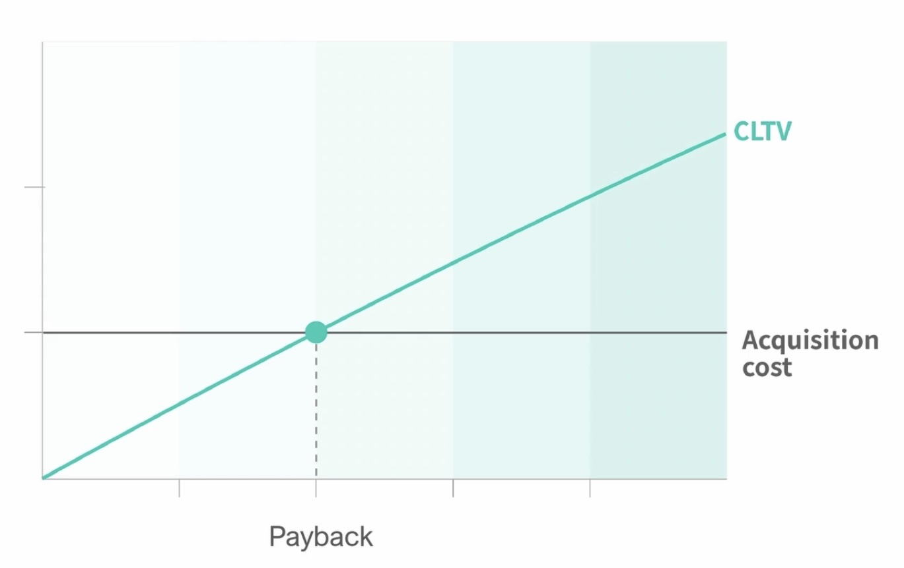
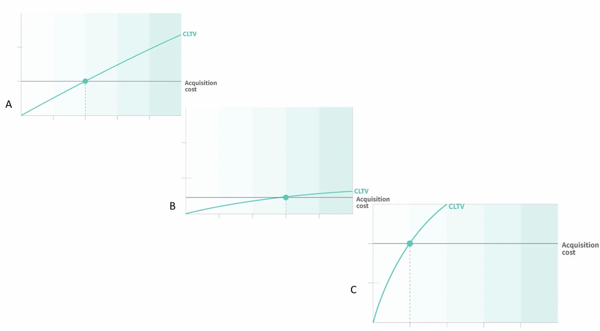

### 1. Unit Economics

- 다양한 스타트업 대표들의 고민 :

**'돈을 얼마나 써서 기업을 얼마나 성장 시킬 수 있는가?' = '우리 서비스의 unit economics를 어떻게 개선할 수 있는가?'**

- 돈을 얼마를 써서 = 고객 한 명을 유치하는 데 얼마를 투자하여 (CAC)

- 기업을 얼마나 성장 시킬 수 있는가? = 고객 한 명 한 명이 우리에게 가져다 주는 수익이 얼마나 될 것인가? 고객생애밸류(CLTV, Customer Life Time Value)

 

- **마케팅 flow** :

1. 이 '고객'이라는 유닛이 어떤 가치를 가지게 되고,

2. 그 유닛을 획득하는 데 얼마를 투자했고,

3. 투자 금액을 수익으로 회수하는 데 얼마나 많은 시간이 걸리는 가

 

---

 

### 2. CAC, CLTV, Payback Period

- **CAC** = 마케팅 예산 / 새롭게 모객한 구매 고객, e.g. 이번 달 마케팅 캠페인 비용 1천만원 / 새롭게 모객된 고객 수 1천명 = 1만원

- **CLTV** = 고객 한 명당 우리에게 가져다 주는 수익(공헌이익 기준) \* 고객의 생애기간

  = (고객이 서비스와 함께하는 생이 기간 동안 만들어내는 거래액 매출 \* 수익률) - 변동비용

⇒ CLTV가 계속 축적이 되어서 CAC 1만원(예시)을 만나는 구간이 12개월(예시) 걸렸다고 하면,

**12개월 = 투자금액인 1만원을 CLTV를 통해 회수한 break even이 맞춰지는 기간 = 페이백 기간**

 

서비스 특성, 성과, 기업의 마케팅 성과 등에 따라 위의 세 가지 KPI가 만들어내는 그래프의 모양은 다를 수 있음.

 

**사례 1. A ⇒ C )**

- 퍼포먼스 마케팅 위주로 초반에 성장, 안정적으로 CAC 타깃하는 범위 내에서 운영, CLTV도 안정적으로 조금씩 축적해 나가면 적절하게 성장. 페이백기간 약 12개월.
- 공격적인 확장 의지 ⇒ 브랜딩 캠페인, ATL(Above the Line) 캠페인, 매스마케팅 캠페인 진행 ⇒ CAC 대폭 상승 (약 2배)
- 새롭게 유입되는 고객 잔존율, 객단가, 재구매 빈도를 바탕으로 CLTV 예측 ⇒ 기존 퍼포먼스 마케팅 채널(검색엔진, 디스플레이 광고) CLTV 대비 수익금액이 축적되는 속도가 굉장히 빨랐음

; CAC 높아지는 것보다 CLTV 개선되는 폭이 더 크면 페이백 시점이 앞당겨짐

 

**사례 2. 경쟁사 A & C )**

- CAC 5천원인 S기업 : 마케팅 우호적, 공격적인 마케팅 예산 ; 객단가가 낮다 보니 구매 건 당 쓰는 비용 적음 & 수익률 낮음 = CLTV 축적 속도 더딤
  (페이백 9개월)
- CAC 2만원인 E기업 : '마케팅 예산을 왜 못 낮추느냐' 회의적 ; 상품 단가 높음, 구매 객단가 높음 & 수익률 높음 + 충성도 높음 = CLTV 축적 속도 빠름 (페이백 3개월)

; S기업에게 리텐션 마케팅을 강화하는 형태로 CLTV 개선하는 것이 좋겠다는 조언, E사에게는 공격적인 마케팅 확장 조언

=> CAC만 보고 마케팅 성과를 판단한다거나, 마케팅 예산 확장에 대한 중요한 결정을 내리는 것은 매우 위험.

=> CAC뿐만 아니라, 모객하는 고객의 퀄리티가 얼마나 좋은지, 고객 한 명을 모객하기 위해 투자금액을 얼마나 빨리 회수할 수 있는지 세 가지 관점에서 서비스를 분석하는 게 매우 중요함.

=> 데이터 기반으로 유닛 이코노믹스를 계산하고, 개선해 나가는 것이 실질적인 기업가치의 상승으로 이어짐

 

---

 

### 3. Case Study

#### 1) 마켓컬리

> Q. 유닛 이코노믹스를 어떻게 정리하고 있는지?

A. CAC는 매번 데일리 체크. 고객밸류계산은 무의미하다고 생각해서 안 보는 편.

 

> Q. 왜 LTV 계산이 무의미하다고 생각하는지?

A. LTV를 생각해보면 두 가지의 큰 가정(1. 고객이 얼마나 쓸 것인가, 2. 고객을 서브하는 데 들어가는 고정비를 제외한 비용을 뺀 공헌이익을 기반으로 계산)해야 하는데, 고객가치(라이프타임동안 낼 수 있는 포텐셜 매출)는 계산이 쉽게 가능. 그런데 비용이 굉장히 어려움 << 가장 큰 비중을 차지하는 게 물류비. 물류비는 규모의 경제에 따라 많이 변하기 때문에, 물류비가 떨어지고 있는 상황에서 무엇을 가정으로 계산을 해야 하느냐가 크리티컬하게 영향을 미치는 편이기 때문에 추정은 하고 절대적으로 신뢰하지는 않음.

고객 매충 추정이 쉽다고 했지만, 그것도 여러 가정이 들어감. e.g. 늘 오늘 썼던 만큼 다음, 그 다음 달에도 쓸 것인가 하면 그렇지 않음. 컬리의 오래 된 코호트라고 하는 고객 그룹은 나이키커브처럼 점점 시간이 지날수록 많이 쓰는데 이것을 반영하는 것은 낙관적인 가정. 이것의 반영 여부에 따라 LTV 계산이 많이 바뀜. 숫자 하나로 보여주기 어려운 개념임.

 

Q. CAC는 어떻게 계산하는지?

A. 보수적으로 보는 편. "획득" 기준을 가입 or 구매 중 구매 기준으로 계산함. (가입기준도 봄, e.g. 가입⇒구매 전환율이 떨어지면 문제를 트래킹할 수 있기 때문에) CAC = 전체 마케팅 비용 / 구매 전환된 고객인데, 정의해야 할 여러 요소가 있음.

- 마케팅 비용 = 올인코스트 (채널비, 혜택까지 포함)
- 구매전환된 고객 = 이번달에 가입 및 구매 고객, 100일전에 가입 이번달에 구매 등 다양. 가입해놓고 구매 안 한 고객 중에 몇 퍼센트가 구매전환하는지 트래킹은 하지만 CAC 계산에서는 제외함. << 이걸 포함하게 되면, 이번 달에 구매한 고객 수가 더 커져 보이는데 그걸 기준으로 마케팅을 집행하게 되면 오류가 나고, 공격적으로 마케팅비용을 쓰게 됨.

 

#### 2) 세컨신드롬

> Q. 유닛 이코노믹스를 어떻게 정리하고 있는지?

A. 공간을 하나의 유닛으로 설정; 유닛 = 셀 혹은 지점, 탑라인 revenue, 임대차 모델(임대료와 관리비), 프로덕트 관리 코스트(보안, 보험, 감가상각), 영업이익 등

운영효율을 높여서 낮추는 방법(무인화 해서 인건비 낮추고 IoT 기술로 자동화) 등

공간에 들어가는 비용을 변동비용으로 설정.

 

> Q. 유닛 이코노믹스를 어떻게 관리, 개선하고 있는지?

A. KPI가 공간에 대한 점유율이기 때문에, 80% 정도 점유율이 달성되면 타깃 수준을 달성하게 됨. 하나의 다락이라는 사이트를 만들기 위해 투입했던 초기 비용을 영업이익으로 회수하는 데 대략적으로 18개월 목표. 이 기간을 어떻게 단축시킬 수 있을 것이냐가 중요한 과제. 18개월보다 페이백이 더 늦어졌다면 운영에 문제가 있다고 판단, 매출을 상승시키든 코스트를 낮추든 운영을 효율화시키든 하는 노력들을 함.

 

#### 3) 비쥬얼 (허세일)

> Q. CAC와 CTV는 어떻게 계산하는지?

A. CAC에 대해 고민이 많았는데, 초기라서 심플하게 진행. 세상에 없던 서비스라서 다른 커머스와 똑같다고 할 순 없음. 1) CPI(Cost per Install) 말 그대로 Acquisition. 네이티브앱 서비스이기 때문에. 2) 회원가입, 좋아요, 장바구니 ⇒ 결제까지 이루어지는 데 있어서의 CAC를 측정. CPI를 1천원 아래로 맞추는 데 초점을 맞추고 있고, 현재 800원 수준. 잘 터지는 캠페인은 300원~400원. CPI 캠페인만 보았을 때 해당 주의 ROAS를 150% 정도로 맞추는 것을 목표로 하고 있음. 월로 봤을 때는 그것보다 좀 더 봐야 함. 구매전환 CAC는 리타게팅 마케팅을 통해 진행. 비용은 4천~6천원 사이. 해당 캠페인의 ROAS가 1400~1500%.

많은 마케팅 채널을 쓰고 있지 않았기 때문에 LTV를 보는 건 쉬운 상황. 파는 제품의 가격 차이가 커서 평균을 내는 것은 무의미. 3개월 내 CPI와 리타게팅 광고를 페북, 구글 많이 사용. 전체 비용의 ROAS를 1400% 정도 만들어 내는 것이 1차 목표. LTV는 모두 비즈니스모델(BM)과 연결. 수수료가 11~14% 수수료이기 때문에 그것보다 높은 ROAS 만드는 것이 목표.

 

#### 4) 와이즐리

> Q. 유닛 이코노믹스를 어떻게 정리하고 있는지?

A. 정의하는 방법은 1) 유닛이 무엇인가, 2) 이코노믹스가 무엇인가 ⇒ 한 개의 유닛 = 한 명의 고객. 그 고객이 낼 수 있는 이코노믹스가 무엇인가를 봄. 이코노믹스는 손익 관점과 현금 관점 두 가지로 봄. >> 손익 관점에서는 고객 당 한 명이 낼 수 있는 CAC vs. LTV Ratio를 보고, 한 명의 고객이 낼 수 있는 이익의 총합이 이 고객을 마케팅해서 데려오는 데 쓴 비용 대비 얼마나 높은가를 보는 것이 손익관점. 현금 관점에선, 고객한테 실제 투자한 금액을 현금 관점에서 빠르게 회수할 수 있는가를 보기 위해 payback period를 봄.

 

> Q. CAC와 CTV는 어떻게 계산하는지?

A. CAC를 정의하는 방법에서는 Acquisition 됐다고 보는 커스터머의 정의가 중요하고, 그것이 '구매'라고 봄. << 게임처럼 사용하다가 중간에 유료 결제가 되는 등의 모델이 아니라, 소수의 상품을 구매할 수 있는 서비스이기 때문에 서비스를 구매한 것 자체를 acquisition이라 봄.

고객들이 들어오는 통로를 두 개로 나눠서 광고 같은 paid 채널, 그리고 organic 채널까지 다 합친 토탈 CAC로 나눠서 봄. << 광고 같은 활동을 통해 보고 있는 효율성과, 통제할 수 없는 organic한 유입에서 들어오는 고객의 수를 나눠서 봐야 광고의 효율성을 측정할 수 있기 때문. + 보수적인 관점을 견지하기 위해. 통제할 수 없는 organic 유입에서 행운이 발생했을 경우, paid 쪽에서 잘했다고 계산할 수 있는 가능성 때문에 total CAC와 paid CAC를 별개로 봄.

LTV를 계산할 때에는, 1) lifetime value에서 '가치'가 무엇인가를 정의하는 것이 중요. 이걸 매출이익의 총합으로 보고 있음. (일부 업체들은 공헌이익의 총합으로 보고 있긴 하지만 비즈니스 모델마다 다르게 적용할 수 있음.) 2) LTV를 측정하는 기간이 중요. 와이즐리는 최대 36개월 정도를 그 기간으로 봄. << 더 길게 잡을 수도 있지만, 36개월보다 더 늦는 쪽에서 나는 밸류는 계산해보면 그 가치가 굉장히 작고, 또한 현금에서의 관점과 괴리가 커지기 때문.

 

> Q. payback period 사용의 주 목적은?

A. 재무적인 자원분배. e.g. '마케팅비를 얼마 쓸 수 있는가'를 결정하기 위함. CAC LTV 비율이 아무리 좋아도 일반적으로 첫구매해서 손익이 마이너스, 캐시가 마이너스가 마이너스이기 때문에 한 번에 데려올 수 있는 고객의 양은 제한되어 있음. 갖고 있는 자본이 한정된 스타트업 입장에선 현금관리가 중요해서 payback period를 보는 것. 실행한 마케팅 효율이 너무 좋아서 더 많은 마케팅 비용을 부으면 더 성장할 수 있다고 해도, finance 팀에서는 마케팅 비용을 부을 수 있는 한도는 2배(예시)이며, 그 이상은 현금을 감당할 수 없다는 의사결정을 하게 됨. 이러한 의사결정에서 payback period가 중요하게 사용됨.

e.g. 마케팅효율이 이전 대비 세배 이상 좋아졌다면, 마케팅팀에서는 볼륨을 빠르게 늘리고 싶어함. 현금의 제약 발생. 재무부서가 해줘야 하는 일은 볼륨을 늘릴 수 있는 한도가 어느 정도인지, 그 이상 늘리고 싶다면 paybackperiod를 단축할 수 있는 방법을 찾으면 가능하다는 의사결정을 하는 것. 판매구조의 변화 마케팅비용의 감축 등.

 

---

 

### 4. 읽을거리

- [잘 쓰고 잘 버는 스타트업의 경제학: 유닛 이코노믹스(Unit Economics)](https://bit.ly/3fpyEzR)
- [Unit Economics, 현대 모바일 커머스 기업 가치의 원천](https://bit.ly/39bjHQD)
