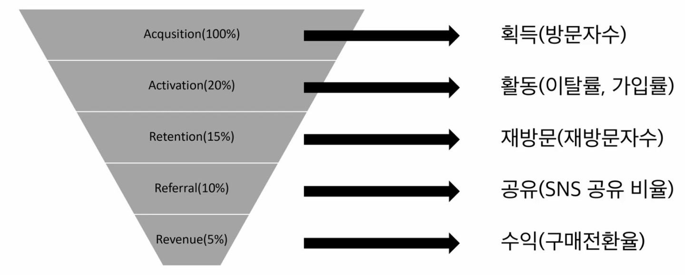
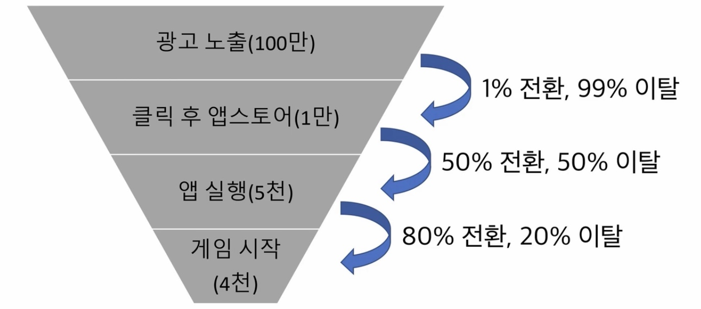
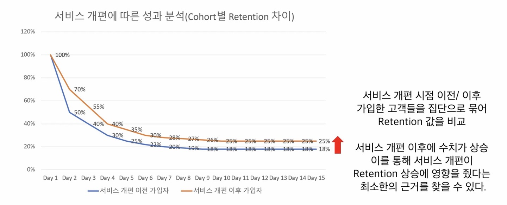

### 1. Funnel 분석

> 퍼널 : 깔때기, '우리 서비스의 어느 부분을 개선해야 하는가?'

- 퍼널 분석의 시작 : 사용자가 서비스를 사용하면서 각 단계를 마주치고 그 다음 단계로 넘어가는 전환율을 숫자로 나타내는 것. 서비스의 각 단계에서 다음으로 넘어갈 때마다 이탈하는 유저가 생김

- AARRR

서비스를 관통하는 큰 퍼널(↑)이며, 더 작은 범위의 퍼널 분석도 가능함. e.g. 회원가입 퍼널, (게임) 상점페이지-결제 퍼널

 

- e.g. 베이글코드의 Acquisition - Activation 퍼널 분석
  

  - 1%가 큰지 작은지 숫자만 보고는 알 수 없음. 동종 업계와 비교 필요.
  - 퍼널 별 숫자가 비슷할 때에는 앞 쪽을 개선해서 뒷단계까지 도달하는 유저 수가 많아지도록 하는 게 좋음
  - 코스팅 해보기 : 각 단계 별로 갖고 있는 문제와 해결방안이 다름. 해결방안을 구현하는 데 걸리는 시간과 노력을 수치로 나타내 보자. '각 단계 별로 개선했을 때 기대되는 효과와 개선하는 데 드는 비용'

- **퍼널 분석 이후 개선해야 하는 구간의 우선순위**

1. 동종업계 대비 크게 이탈되는 구간 공략

2. 비용 대비 효과를 감안하여 가성비 높은 구간을 공략

3. 숫자가 큰 퍼널의 앞쪽을 공략

 

---

 

### 2. Cohort 분석

> 코호트 : '공통적인 특성을 지닌 사람들의 집단'

- 특성 : 성별, 연령, 지역, 오가닉/페이드, 유입 채널, 가입 시기(월, 주, 일 → 서비스가 개선되고 있는지 문제가 있는지 파악 가능) 등
- 코호트 분석 = 코호트 별로 특정 지표(e.g. 리텐션)를 비교하는 분석
- 리텐션 : 재방문(구매). 서비스를 운영하는 데 가장 중요한 지표 중 하나. (Day 1 리텐션 = 오늘 가이반 사용자가 다음날 재방문하는 비율. Day 7 리텐션 = 오늘 가입한 사용자가 다음주 오늘 다시 재방문하는 비율. 이런 식으로 30일, 6개월, 1년 리텐션을 볼 수도.) 리텐션도 시간의 흐름에 따른 커다란 퍼널.

- 베이글코드 예시(퍼널 분석과 코호트 분석을 엮어서)

  - 처음 실행 시 게스트 계정으로 로그인되고 바로 플레이 됨 →

  - 적당한 때에 페북이나 구글 계정 연동하라고 알림 →

  - (계정 연동하는 사용자 비율을 높여보자는 KPI 설정하고 업데이트) →

  - 처음 실행 시 게스트 계정으로 로그인이 아니라 어떤 계정으로 로그인할 것인지 묻는 코호트 (페북, 구글, 게스트) →

  - 계정 연동 비율은 올라갔지만, 게임을 플레이하는 사용자 수가 줄어듦 →

  - 처음 실행 시 게스트 계정으로 로그인으로 다시 변경하는 것으로 선택함

 

**⇒ 퍼널 분석은 '서비스를 단계 별로 나눠서 도달율/이탈율을 측정하는 방법, 우리 서비스가 어느 부분이 취약하고 어디부터 개선해야 하는지 알려주는 도구**

**⇒ 코호트 분석은 '사용자를 나눠서 그룹들 간에 차이를 비교해보는 것'**

**⇒ 퍼널분석과 코호트분석을 동시에 같이 사용할 수도 있음**

 

---

 

### 3. Case Study

#### 1) 와이즐리

> Q. 퍼널 관리에서 가장 큰 병목은 어느 구간이었나요?

A. 첫구매에서 두번째 구매로 넘어가는 구간. 일반적으로 구독서비스들이 비슷한 구간에서 병목을 겪음. 당시 그 구간에서 넘어갈 확률이 60% 정도였음. 오히려 그 뒤에 계속 서비스를 사용할 확률은 80% 정도였기 때문에, 앞의 60%를 어떻게 올릴 수 있는가가 성과 개선의 킹핀이었음.

 

> Q. 해당 부분을 어떻게 개선했나요?

A. 크게 두 가지 방법을 사용함. 1) 60% 첫 재구매율이라는 숫자의 하위 지표를 개선하는 방법, 2) 이 지표가 높은 고가치 고객의 비중을 늘리는 방법.

1. 첫 구매에서 두 번째 구매로 가기 위한 여정을 쪼개서 트래킹함. ① 물건을 받아서 사용한 후에 재구매하겠다고 마음 먹는 구간, ② 실제로 재구매하는 구간. ①에서는 면도날 퀄리티가 마음에 안 들어서가 가장 큰 이유였고, ②에서는 귀찮아서 미루다가 가족이 사오는 경우 등. 그래서 ①에서는 면도날 퀄리티를 개선한 업그레이드 된 제품을 내놓음.

2. 똑같은 60%라는 숫자를 break down 해보면 어떤 고객군은 80~90% 나오는 고객들이 있고, 40% 나오는 고객들이 있음. 이걸 weighted average(가중평균)로 평균을 내면 60%가 나옴. 즉, 높은 수치를 가진 고객 비율을 높이면, 전체 평균 숫자도 높일 수 있다는 뜻. 와이즐리에게는 고가치 고객의 기준이 '구독자', 상대적으로 낮은 가치를 가진 고객의 기준이 '비구독자'였음. 구독자의 경우 89% 숫자를 나타내고 있곴고, 비구독자는 40%선. ⇒ '구독자들의 비중을 높이자'는 initiative 실행함. ⇒ 60%→85%로 높아짐. 구독자를 높이는 방법으로는 '애초에 구독자로 가입할 수 있는 확률이 높은 사람을 끌어오는 방식.' 마케팅 메시지 변경함. '면도날 가격이 너무 비싸지 않은가' ⇒ '오래된 면도날, (구독의 핵심가치인)습관을 바꿔줄 수 있다'는 커뮤니케이션 메시지로 변경.

 

#### 2) 스푼라디오

> Q. 퍼널 관리에서 가장 큰 병목은 어느 구간이었나요?

A. '앱노출→앱설치→앱본질알리기→회원가입 유도→방송듣기→결제'에서 가장 힘든 건 앱 자체를 알리는 것. 우리나라는 앱 피로도가 높기 때문에, 짧은 모바일화면 몇 초만에 어필을 할 수 있는 방법이 필요함. 로그인 후에도 콘텐츠 플랫폼이다보니, 고객들이 좋아하는 콘텐츠를 제공하는 부분에 대한 퍼널, 결제까지 이어지는 퍼널도. 퍼널이 하나 개선됐다고 이탈율, 결제율이 지속되는 게 아님. 특히 10대 20대는 변화가 빨라서 중요 퍼널 별로 데이터를 보면서 항상 관리해야 함.

 

> Q. 해당 부분을 어떻게 개선했나요?

A. 앱 설치후에 푸시메시지 전송. 누구는 설치하고 몇시간 사용하고 종료하고, 5분만에 종료하고, 설치만하고 실행 안 하는 경우가 있음. 고객별로 추천화된 푸시 메시지를 전송함. dj추천, 이벤트 응모 등 커스터마이징 된 푸시 메시지가 효과가 좋았음. 2~3% 리텐션 개선됨.

 

#### 3) 비쥬얼

> Q. 퍼널 관리에서 가장 큰 병목은 어느 구간이었나요?

A. 모든 구간에 병목. 가장 큰 부분은 acquisition→activation. activation의 정의는 팀마다 다르지만 회원가입하고 상품에 대해 관심을 표명하는지까지가 포인트. 또, 모바일 앱서비스이다보니, 앱깔고 회원가입하는 허들에서 많은 이탈. 이 비용을 줄이는 게 CAC를 줄이는 데 있어서 핵심 키포인트라고 생각함. 쿠폰이나 혜택을 제공해서 이 부분을 개선. 가장 집중하고 있는 건 리텐션. 누적 앱 다운로드가 40만 넘었고, 절반 정도를 리텐션 잡아오고 있는데, 어렵게 모신 고객인 만큼 재방문, 재구매를 가장 큰 포인트로 잡음. 체류시간이 늘어나야 구매전환이 올라는 서비스 타입이라, 기능개발, 상품 매력도 올리기, 상품 커버리지 늘리기(상품 SKU-Stock Keeping Unit-수 늘리기). 한 가지 방법만으로 리텐션이 개선된다고 생각하지 않고, 모든 게 연결돼 있음.

 

> Q. 해당 부분을 어떻게 개선했나요?

A. Aquisition(설치단계에 서비스에 처음 접근)→Activation(회원가입, 좋아요, 카트에 넣는 단계) : 어떤 광고채널에서 어떤 소재를 쓰느냐에 따라서 마케팅단에서 테스트하고 있음. 회원가입을 통해 activation되는 구간도, 회원가입을 해야지만 여러 활동을 할 수 있게끔 만들어져 있어서 이슈가 있었음. 리텐션 부분도 누적다운로드 40만 중 절반만 남아 있는데, 1년 정도 시간 동안 체류시간에 있어서 많은 개선이 이뤄지진 못함. 체류시간-페이지뷰-구매전환의 연결고리.

웹을 만들고 비회원 구매가 가능하도록 큰 틀에서 개선, 회원가입 단계에서 이탈하는 고객들에게 쿠폰 제공. 좋아요나 장바구니까지 갔는데 이탈한 고객들 대상으로 마케팅 진행, 쿠폰 제공. 개선이 돼서 전테 고객의 70%정도가 한달에 1~1.5번→3~4번 정도로.

페이지뷰는 기능적인 걸로만 개선하긴 어려워서 브랜드 커버리지에 초점. 태그 서비스를 넣어서 태그를 타고 넘어가서 계속 구매할 수 있게 하는 것도 좋았지만, 그것만으론 부족하고 사람들이 알고 있는 백화점 브랜드들이 함께 하면서 효과가 좋았음.

 

#### 5) 프레시코드

> Q. 퍼널 관리에서 가장 큰 병목은 어느 구간이었나요?

A. 음식서비스이다 보니, 구매가 가장 큰 허들. 프코스팟이 초반에 별로 없었고, 이용할 수 있는 사람도 제한되다 보니, 선뜻 이용하기 어려웠음. 현재는 서비스가 좋아져서 구매전환율이 높아졌고, 리텐션을 중요하게 보고 있음. M0(첫번째 획득한 달)부터 M12까지 펼쳐봤을 때, 장기적으로 M12에서 올라가는 그래프를 추구하고 있음.(스마일 그래프)

스마일 그래프를 만들고 싶은 이유 중 하나는, 마케팅비를 계속 투입해서 유지되는 비즈니스보다는 언젠가 고객이 다시 돌아와 구매하는 비즈니스를 만들고 싶은 것.

 

> Q. 해당 부분을 어떻게 개선했나요?

A. 메뉴를 늘린다든지, 신뢰감을 줄 수 있는 설명들, 내가 고객이라면 어떤 때에 부담을 느끼고 이탈할지에 대한 부분들을 고려하면서 UX/UI개선. 유저프렌들리한 사이트를 만들기 위해 노력. 오픈된 프코스팟을 로고로 보여줬는데, 200개 정도로 늘어나다 보니 지도화를 해서 고객들이 안정감을 느끼고 주문이 쉬워짐.

장기적으로는 서비스가 삶 안에 들어가야 한다고 생각. 점심 위주의 서비스, 직장인 대상 서비스인데, 이런 부분을 아침, 점심, 저녁으로 늘려나가면 고객에게 유의미한 서비스가 될 수 있을 것. 한 가지만 개선한다고 갑자기 숫자가 튀지는 않음. 빈 구멍, 고객이 부담을 덜 느끼고 편한하게 이용할 수 있는 사이트, 여러 기능들을 조금씩 개선되어 합쳐지면 더 큰 고객경험의 개선이 일어난다고 생각.

 

#### 6) 크몽

> Q. 퍼널 관리에서 가장 큰 병목은 어느 구간이었나요?

A. 초기에는 구매전환에서 가장 큰 병목. 무형의 서비스를 판매하는 새로운 개념의 마켓이다 보니, 새로운 고객이 들어와도 실제 구매가 일어나지 않음. 두번째는 재구매가 큰 병목. 목적성 구매로 들어오기 대문에 한번 와서 구매하고 나면 재구매를 하지 않는 특성.

구매전환이 낮았던 이유는, 결제 자체 비율도 낮았지만 결제 취소하는 비율이 높았음. 일을 하는 과정에서 결렬되는 경우 많았음. 무형의 서비스가 거래되게 하려면 서비스를 상품화하는 게 무엇보다 중요하다고 판단. Saap(Service as a Product)라 명칭하고, 모든 서비스들을 규격화해서 사전에 다 정의함. 거래하다가 생길 수 있는 분쟁 요소들을 사전에 다 정의함으로 해서 그 결제 후에 생길 수 있는 문제를 최소화해 나가는 과정을 거침. 취소율이 30~40%→10% 이하로 감소. 이 작업은 계속해서.

 

> Q. 해당 부분을 어떻게 개선했나요?

A. 예를 들어 로고 디자인을 하면, 수정 및 여러 문제가 생기는데 어떻게 거래가 가능한가. 로고에 대한 포트폴리오를 충분히 보여주고, 로고 디자인 수정이 몇 회가 가능한지, 상업적으로 어디까지 쓸 수 있는지 등에 대해 다 정의하게끔 하는 것이 규격화. 카테고리 별로 규격화를 계속 해나가는 게 핵심 비즈니스 모델이고, 실제로 취소율이 꾸준히 줄어듦.

재구매유도가 어렵지만 필요함. 그러나 그 앞단에 선행되어야 할 것은, 한 번에 거래할 때 큰 거래를 만드는 것. 로고를 디자인하면, 명함, 카탈로그 디자인, 마케팅까지 크로스셀이 일어날 수 있게끔해서 전체 거래금액 자체를 늘리는 노력을 통해 ARPU(Average Revenue per User)자체를 증가시킬 수 있게 됨.

 

---

 

### 4. 읽을거리

[꼭 짚어보아야 할 7가지 모바일 앱 전환 퍼널](https://bit.ly/3nLeEdO)
[스타트업 데이터 분석](https://www.slideshare.net/mobile/LeeGwan/ss-42159541)
[코호트 분석을 비즈니스에 활용하는 방법](https://brunch.co.kr/@entrench/105)
